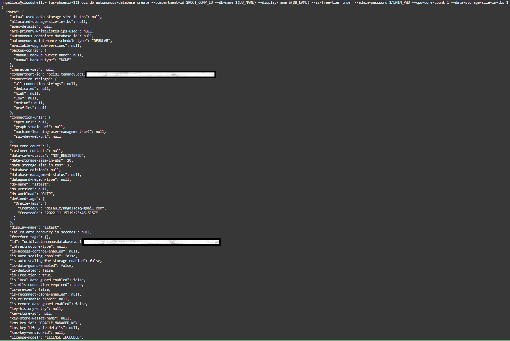
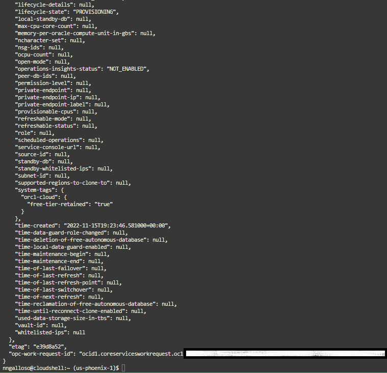
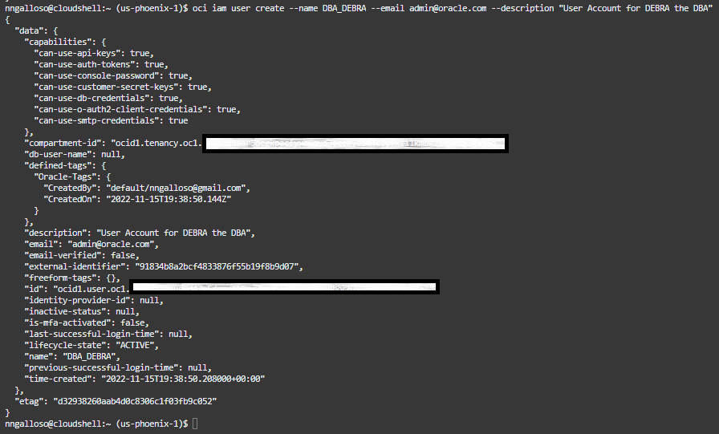
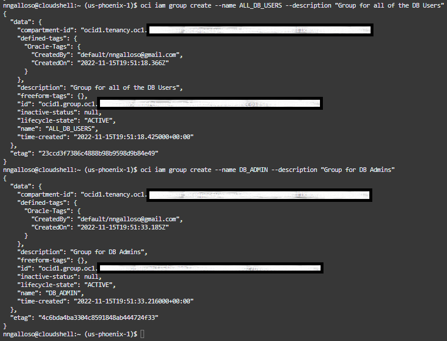

# Create ADB and set up Environment

## Introduction

The Oracle Cloud Infrastructure (OCI) Cloud Shell is a browser-based terminal accessible
from the Oracle Cloud Console. It is a Linux shell pre-configured with the OCI CLI available to all user, and is available to all OCI users. It offers an interface to quickly and easily perform operations such as provisioning resources and connecting to database services. We will use the cloud shell throughout this workshop, and in this lab will use it to provision items such as an Autonomus Database, users, groups, and policies.

*Estimated Lab Time*: 15 minutes

### About Product/Technology

### Objectives
- Provision an Autonomous Database (ADB)
- Create and associate Users and Groups within Identity and Access Management (IAM)
- Connect to the provisioned ADB

### Prerequisites
This lab assumes you have:
- A Free Tier, Paid or LiveLabs Oracle Cloud account
- You have completed:
    - Lab: Prepare Setup (*Free-tier* and *Paid Tenants* only)
    - Lab: Environment Setup
    - Lab: Initialize Environment


## Task 1: Provision the Autonomous Database
>**Note:** It is advised that you do not perform this lab in a production tenancy due to policies created in this lab that give all users access to all ADBs in the tenancy.

1. Beginning at your Oracle Cloud Infrastructure home page, access the Cloud Shell
by clicking on the **Cloud Shell** icon in the top right corner. You will use the Cloud Shell
throughout this workshop.

    

1. Using the Cloud Shell, identify the root compartment to create the ADB and IAM policy in.
    >**Note:** If at any point in this workshop you exit out of the Cloud Shell, you may need to redo
<<<<<<< HEAD:oci-adb-iam/lab1_setup-environment-and-cloud-shell/lab1_setup-environment-and-cloud-shell.md
    this step and any others that use the "export" command. The variables created with "export" that are used in future steps are deleted when the Cloud Shell session ends.  
=======
this step and any others that use the "export" command. The variables created with "export" that are used in future steps are deleted when the Cloud Shell session ends.
>>>>>>> 1630f970d56517b9d7ad252b1ae8ef89d1eb0a64:oci-adb-iam/livelabscode/lab1_setup-environment-and-cloud-shell/lab1_setup-environment-and-cloud-shell.md

    ```
    export ROOT_COMP_ID=`oci iam compartment list --include-root --raw-output --query "data[?contains(\"id\",'tenancy')].id | [0]"`
    ```

2. Create the name for your ADB

    ```
    export DB_NAME=lltest
    ```

3. Create your password for the database

    ```
    export ADMIN_PWD=Oracle123+Oracle123+
    ```

4. Record your OCI user name to be used in future commands.

    ```
    export OCI_USER_NAME=`oci iam user list --raw-output --query "data[?contains(\"id\",'"${OCI_CS_USER_OCID}"')].name| [0]"`
    echo $OCI_USER_NAME
    ```
    

5. Create the ADB with the name and password defined in previous steps.

    ```
    oci db autonomous-database create --compartment-id $ROOT_COMP_ID --db-name ${DB_NAME} --display-name ${DB_NAME} --is-free-tier true  --admin-password $ADMIN_PWD --cpu-core-count 1 --data-storage-size-in-tbs 1
    ```
    
    
    

6. Create a policy to allow any user in the tenancy to access the ADB.

    ```
    oci iam policy create  --name grant-adb-access --compartment-id $ROOT_COMP_ID  --statements '[ "allow any-user to use autonomous-database-family in tenancy"]' --description 'policy for granting any user to access autonomous databases'
    ```
    

## Task 2: Create and assign test user and groups

1. Create a test user Debra.

    ```
    oci iam user create --name DBA_DEBRA --email admin@oracle.com --description "User Account for DEBRA the DBA"
    ```
    

2. Create two groups in IAM, one for all database users and one for database admins.

    ```
    oci iam group create --name ALL_DB_USERS --description "Group for all of the DB Users"
    ```
    ```
    oci iam group create --name DB_ADMIN --description "Group for DB Admins"
    ```
    

3. Setup and verify environment variables for ease of use in commands later.
    >**Note:** If at any point after this step you exit out of the cloud shell, these commands may need to be ran again.

    ```
    export ADB_OCID=`oci db autonomous-database list --compartment-id $ROOT_COMP_ID --raw-output --query "data[?contains(\"db-name\",'lltest')].id | [0]"`
    echo $ADB_OCID
<<<<<<< HEAD:oci-adb-iam/lab1_setup-environment-and-cloud-shell/lab1_setup-environment-and-cloud-shell.md

    export DB_ADMIN_OCID=`oci iam group list --raw-output --query "data[?contains(\"name\",'DB_ADMIN')].id | [0]"`
    echo $DB_ADMIN_OCID

    export ALL_DB_USERS_OCID=`oci iam group list --raw-output --query "data[?contains(\"name\",'ALL_DB_USERS')].id | [0]"`
    echo $ALL_DB_USERS_OCID

=======
    ```
    
    ```
    export DB_ADMIN_OCID=`oci iam group list --raw-output --query "data[?contains(\"name\",'DB_ADMIN')].id | [0]"`
    echo $DB_ADMIN_OCID
    ```
    
    ```
    export ALL_DB_USERS_OCID=`oci iam group list --raw-output --query "data[?contains(\"name\",'ALL_DB_USERS')].id | [0]"`
    echo $ALL_DB_USERS_OCID
    ```
    
    ```
>>>>>>> 1630f970d56517b9d7ad252b1ae8ef89d1eb0a64:oci-adb-iam/livelabscode/lab1_setup-environment-and-cloud-shell/lab1_setup-environment-and-cloud-shell.md
    export DBA_DEBRA_OCID=`oci iam user list --raw-output --query "data[?contains(\"name\",'DBA_DEBRA')].id | [0]"`
    echo $DBA_DEBRA_OCID
    ```
    

4. Add your test user Debra to both groups that were created earlier.

    ```
    oci iam group add-user --user-id $DBA_DEBRA_OCID --group-id $ALL_DB_USERS_OCID
    ```
    
    ```
    oci iam group add-user --user-id $DBA_DEBRA_OCID --group-id $DB_ADMIN_OCID
    ```
    

5. Add your cloud shell user to the ALL\_DB\_USERS group

    ```
    oci iam group add-user --user-id $OCI_CS_USER_OCID --group-id $ALL_DB_USERS_OCID
    ```
    
